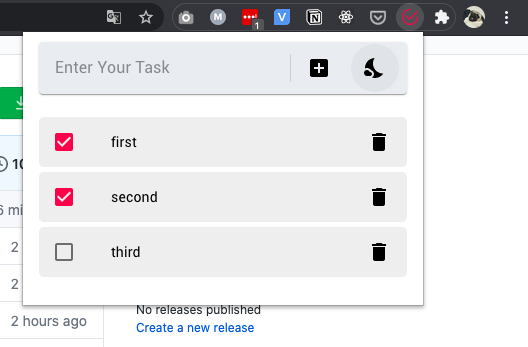
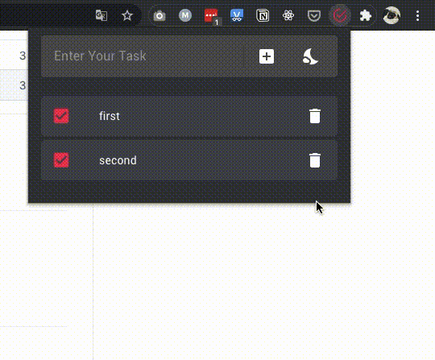

# TickList-react-chrome-extension

[](https://ci.appveyor.com/project/danielkrupnyy/tickplate-react-chrome-extension)
[](https://david-dm.org/danielkrupnyy/TickPlate-react-chrome-extension.svg)

##Features

- Simple [React-based](https://github.com/facebook/react) Todo List
- Ability to change theme, light/dark
- Using [chrome.storage](https://developer.chrome.com/apps/storage) & [Chrome Popup Action](https://developer.chrome.com/extensions/browserAction#popups)
- For UI was using [Material-UI](https://material-ui.com)

## Examples

#### Popup



#### Dark theme



## Installation

```bash
# clone it
$ git clone https://github.com/danielkrupnyy/TickPlate-react-chrome-extension.git

# Install dependencies
$ npm install
```

## Running & Build

```bash
$ npm run dev
```

After running comand above, webpack will create build folder. This is a finished app. You can load it to your browser.

## LICENSE

[MIT](LICENSE)
